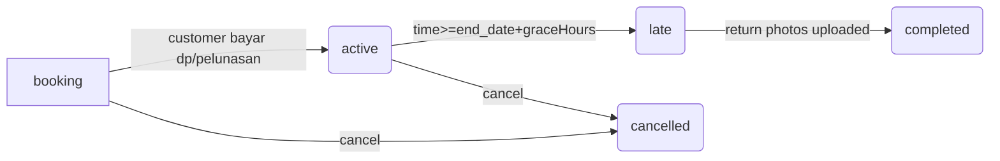

# MudahSewa — System Architecture & Wiring Diagrams

## 1. Overview

MudahSewa adalah aplikasi **rental camera & digicam** dengan fitur:
- ✅ **Customer self-checkout**: katalog produk, ketersediaan real-time, checkout langsung via browser
- ✅ **Payment gateway integrations**: GoPay QRIS dinamis (merchantid OAuth), QRIS statis, transfer bank manual
- ✅ **WhatsApp integration** (OpenWA): reminder COD otomatis (3h/1h/30m/5m sebelum pickup), status order, broadcast promo
- ✅ **Admin portal**: manajemen order, pelanggan, unit fisik, dashboard statistik
- ✅ **Portal customer**: tracking order, upload bukti bayar/dokumen jaminan (KTP/selfie)
- ✅ **CRM & blacklisting**: pelacakan pelanggan bermasalah
- ✅ **Audit trail**: jejak perubahan setiap order/unit/pembayaran

**Tech stack:**
```
┌─────────────────┐     ┌──────────────┐     ┌─────────────────┐
│   Next.js 16    │◄───│   Prisma     │────►│    SQLite       │
│   TypeScript    │     │   ORM        │     │   (WAL mode)    │
│   Server Actions│     │   Client     │     ├─────────────────┤
└────────┬────────┘     └─────┬────────┘     │ Customer DB     │
         │                    │              │ Product DB      │
         │                    │              └────────┬────────┘
         │                    │                     │
         ▼                    ▼                     ▼
┌─────────────────┐  ┌─────────────────┐    ┌─────────────────────┐
│   GoPay API     │  │  OpenWA HTTP    │    │   Redis / Session   │
│   REST          │  │   Websocket     │    │   (not used yet)    │
└─────────────────┘  └─────────────────┘    └─────────────────────┘
```

---

## 2. Core Modules & Data Flow

### A. Authentication & Roles

**Users** model → `role`: `admin` | `mitra`
- **Login**: credentials provider (`email/password` hash bcrypt) + custom customer provider (`phone/password`)
- **Session**: JWT strategy (`@auth/prisma-adapter`)
- **Middleware**:
  - `requireUser()` → throw 401 bila tidak login
  - `requireAdmin()` → throw 403 bila bukan role admin
  - `requireMitraOrAdmin()` → both staff roles allowed

**NextAuth pages**: `/login`, `/logout`; protected routes via middleware atau guard function.

---

### B. Order Lifecycle

**Order model** statuses (transisi):



**Key fields:**
- `orderNumber` (unique max-based counter per day)
- `startDate/endDate` + `chargingRestHours` → buffer auto-block unit availability
- `deliveryMode` (`pickup`|`courier`) + `deliveryAddress`
- `paymentMethod` (`cash`|`qris`|`midtrans`|`gopay`|`transfer_*`)
- `paymentStatus` (`unpaid`|`pending`|`paid`|`partial`|`refunded`)
- `paymentCompleted` boolean (true bila customer submit semua field wajib per metode pembayaran)

---

### C. Products & Units

**Product model** (logical product type):
- Price tiers: `price6h`, `price12h`, `price24h`, `price48h`
- Stock threshold: min units untuk aktif di katalog
- Charging rest hours: minimum jam tunggu setelah rental selesai (unit perlu charge/istirahat dulu)

**Unit model** (physical serial number):
- `serialNumber` (unique)
- Condition: `Bagus` | `Cukup` | `Rusak`
- Status: `available` | `rented` | `maintenance` | `lost`
- Photo: `/uploads/units/{id}.jpg`

**Flow:**
```
Customer picks Product (e.g., Canon IXUS) 
      ↓
Checkout selects duration (24h) → calculates price (price24h)
      ↓
Admin activates order → assigns specific Unit with serial "CANON-IXUS-001"
      ↓
Unit status changed → `available` → `rented`
      ↓
Return photos uploaded → condition checked → Unit status updated back
```

---

### D. Payments & Gateways

#### Payment Model
- `paymentType`: `dp` | `pelunasan` | `denda`
- `method`: cash|qris|transfer_bca|transfer_mandiri|midtrans|gopay_qris
- `proofPath`: `/uploads/payments/bukti-{orderId}.jpg`
- Gateway flows:
  1. **Transfer Bank**: customer upload bukti → admin verify manually
  2. **GoPay QRIS**: dynamic generation via merchantid session OAuth
     - Polling uniqueAmount every ~30s until `status: paid`
     - Auto-link payment to order when amount matches
  3. **Midtrans**: snap redirect (TODO)

#### Gopay Session Management
Single row `GopaySession` (id=1):
- Stores OAuth tokens, merchant ID, phone, last login timestamp
- Token auto-refreshes every 6h
- Sensitive session JSON stored encrypted? No—just env protection needed

---

### E. WhatsApp Integration (OpenWA)

**Architecture:**
```
┌──────────────┐
│  Scheduler   │ ← cron task runs every minute
└──────┬───────┘
       │ checks CodReminder table for slots due
       ▼
┌──────────────┐     ┌──────────────────┐
│  Template    │──►─│  Send Message    │
│  (3h/1h/etc) │     │  via OpenWA API  │
└──────────────┘     └────────┬─────────┘
                               │ chatId=formatted phone
                               ▼
                        ┌──────────────┐
                        │ Success log  │
                        │ Failed retry │
                        └──────────────┘
```

**CodReminder model**: 1 row per order × slot (4 slots total: `3h`, `1h`, `30m`, `5m`)
- Status: `pending` → `sent` or `skipped` (if order completed early)
- Error logging for failed sends

**Templates** (per slot):
```
"Halo [name], reminder: waktu pengambilan rental [orderNumber] untuk [produk] dalam 3 jam lagi ya! Mohon siapin KTP/kartu pelajar sebagai jaminan. Ada pertanyaan? Chat admin di WA ini!"
```

---

## 3. API Routes Structure

### Public APIs
| Endpoint | Auth | Purpose |
|----------|------|---------|
| `POST /api/checkout` | None | Create/edit order form submission (Server Action fallback) |
| `GET /api/availability` | None | Check stock availability for given duration window |
| `GET /api/payments/generate-qris` | Admin only | Generate dynamic QRIS payload (GoPay) |

### Webhooks
| Endpoint | Source | Handler |
|----------|--------|---------|
| `POST /api/payments/notify` | Midtrans server-to-server | Verify signature_key, update payment.status → `confirmed` |
| `POST /api/payments/gopay/feed` | GoBiz webhook (optional) | Update `uniqueAmount` polling result (fallback manual poller) |

---

## 4. File Structure Summary

```
src/
├── actions/           # Server Actions (mutates data via Prisma)
│   ├── orders.ts
│   ├── payments.ts
│   ├── gopay-gateway.ts (spawns gopay gateway as detached child)
│   └── openwa-gateway.ts (spawns OpenWA worker if needed)
├── lib/               # Pure functions & Prisma helpers
│   ├── auth.ts (NextAuth setup)
│   ├── db.ts (singleton prisma instance)
│   ├── reminders/scheduler.ts (cron task for COD reminders)
│   ├── gopay-client.ts (HTTP client to :3100)
│   ├── openwa-api-client.ts (HTTP/WebSocket client to :2785)
│   └── availability.ts (complex date span overlap logic)
└── app/
    ├── (shop)/        # Public storefront (katalog, checkout)
    ├── admin/         # Protected staff portal
    ├── portal/        # Customer portal (tracking, upload)
    └── api/           # REST endpoints
```

---

## 5. External Integrations

### GoPay Merchantid
- Library: `gopay-api-gateaway` (Node.js microservice on port 3100)
- Responsibilities:
  - Terminal authentication (OTP login via browser automation)
  - Dynamic QRIS generation per order
  - Token refresh every 6h
- Deployment: PM2 service `gopay_gateway`

### OpenWA
- Library: `rmyndharis/openwa` Docker image (running natively via PM2 now)
- WebSocket protocol for real-time WhatsApp messages
- Dashboard UI at `/dashboard` (protected by API key)

---

## 6. Security Considerations

- **DB access**: SQLite file in production directory (mode 664 for read/write)
- **PII protection**: Customer name/phone/address encrypted? No—at rest via server permissions + backup encryption recommended
- **Password hashing**: bcrypt work factor 10
- **API keys**: never stored in codebase; loaded via `.env` files
- **Audit logs**: all CRUD operations logged with user ID for accountability

---

## 7. Scalability Notes

Current design assumes single-node deployment with SQLite WAL mode:
- Reads concurrent OK (via WAL snapshot isolation)
- Writes queued sequentially
- Suitable for <1000 orders/month; beyond that, migrate to PostgreSQL

Future phases:
- Queue jobs (bullmq/RabbitMQ) for reminder sending
- Image storage migration to S3/MinIO
- Real-time inventory sync across multiple branches

